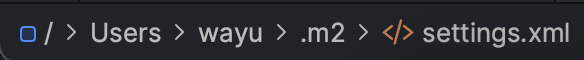
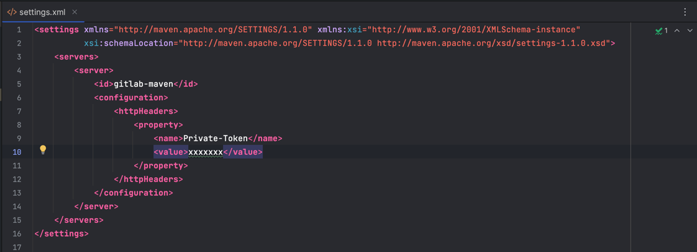

# Spring Boot Starter
- Spring boot microservice template
- This can be used as `resources server`


## Tech stack
- Java 17+ JDK
- Git
- Docker / Docker-compose
- Maven
- Junit5 / Mockito
- Postgres
- JPA
- Swagger
- Actuator
- Flyway / LiquidBase
- Spring Boot 3.1+
- Spring Security
- Kubernetes

# Maven Dependencies
- used custom dependency to centralize all the libraries and class etc. 
```xml
<dependency>
    <groupId>com.quinsic.foundation</groupId>
    <artifactId>app-core</artifactId>
    <version>${app-core}</version>
</dependency>
```

## Pre-requisite
- [ ] configure your `Users/${user}/.m2/settings.xml` 
- [ ] put down your `GitLab/GitHub` `accessToken` 
  - [GitLab Generating Token Link](https://deloitte.team/help/user/profile/personal_access_tokens.md#create-a-personal-access-token)
- [ ] Docker running mysql image
- [ ] go and see `docker-compose` in `cd ~/.setup`

## Testing
- [ ] [swagger link](http://localhost:9000/swagger-ui.html)


## Design Principle
### Directories structure
- config
- endpoint
- entity
  - dto
  - po
- exception
- repository
- service
- usecase `optional`

## Oauth2 - Resources Server
Spring Security 5.1 Resource Server only supports JWK-signed JWTs as authorization <br>
`spring.security.oauth2.resourceserver.jwk-set-uri=http://localhost:8081/sso-auth-server/.well-known/jwks.json`